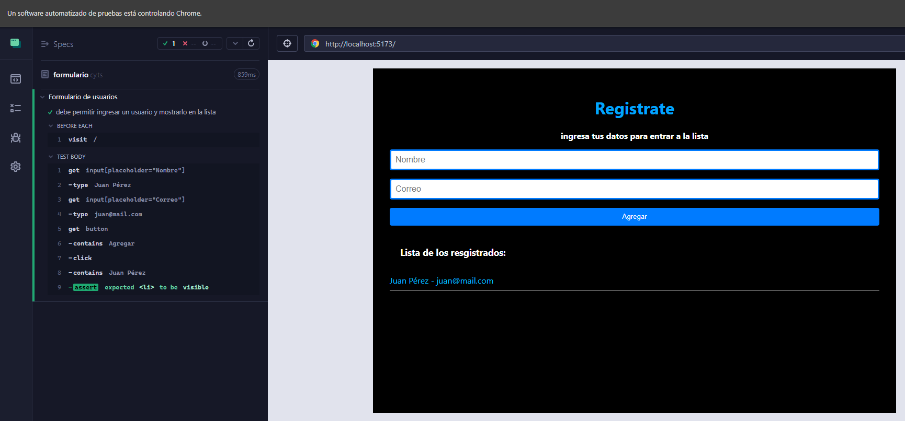
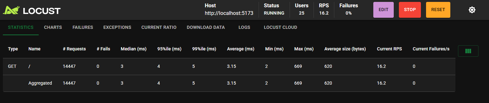
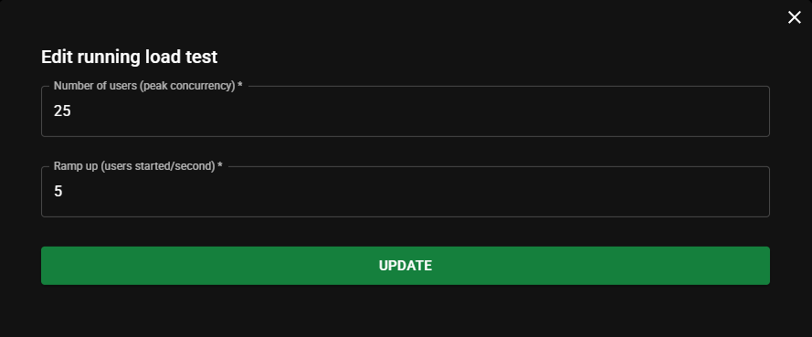

# React SPA + Docker + Pruebas Automatizadas

Este proyecto es una Single Page Application (SPA) desarrollada con React y Vite. Permite registrar usuarios con nombre y correo y mostrarlos en una lista. Además, incluye pruebas automatizadas y un flujo de integración continua (CI) con GitHub Actions.

## Características principales

- Registro básico de usuarios
- Estilo minimalista con CSS
- Pruebas end-to-end (E2E) con Cypress
- Pruebas de rendimiento con Locust
- Automatización de pruebas y despliegue con GitHub Actions

## Vista de la aplicación

Formulario funcional con prueba automatizada E2E con Cypress:



## Pruebas Automatizadas

### Cypress - Prueba E2E

Se implementó una prueba end-to-end para validar el flujo de registro:

1. El usuario escribe su nombre y correo
2. Hace clic en "Agregar"
3. El sistema agrega el usuario a la lista y lo muestra en pantalla

Archivo de prueba: `cypress/e2e/formulario.cy.ts`

```tsx
cy.get('input[placeholder="Nombre"]').type("Juan Pérez")
cy.get('input[placeholder="Correo"]').type("juan@mail.com")
cy.get("button").contains("Agregar").click()
cy.contains("Juan Pérez").should("be.visible")
```
## Vista del test con locust




### Locust - Prueba de Rendimiento

Se configuró Locust para simular múltiples usuarios concurrentes accediendo al sitio. Se usaron los siguientes parámetros:

- Número de usuarios: 25
- Incremento de usuarios por segundo: 5



Archivo: `locustfile.py`

```python
from locust import HttpUser, task, between

class FrontendUser(HttpUser):
    wait_time = between(1, 2)

    @task
    def cargar_home(self):
        self.client.get("/")
```
## CI/CD con GitHub Actions

El flujo de trabajo de GitHub Actions se ejecuta automáticamente con cada push o pull request a la rama `main`. El flujo realiza lo siguiente:

- Instala dependencias
- Levanta la aplicación
- Ejecuta pruebas E2E con Cypress en modo headless
- Ejecuta pruebas de rendimiento con Locust

Fragmento del workflow `.github/workflows/ci.yml`:

```yaml
npx cypress run --headless
locust -f locustfile.py --host=http://localhost:5173 --headless -u 10 -r 5 -t 10s
```
## Tecnologías utilizadas

- React
- Vite
- TypeScript
- Cypress
- Locust
- Docker (para despliegue)
- GitHub Actions

## Instrucciones para correr localmente

```bash
# Instalar dependencias
npm install

# Levantar la aplicación
npm run dev

# Ejecutar pruebas E2E
npx cypress open

# Ejecutar pruebas de carga
python -m locust
```
